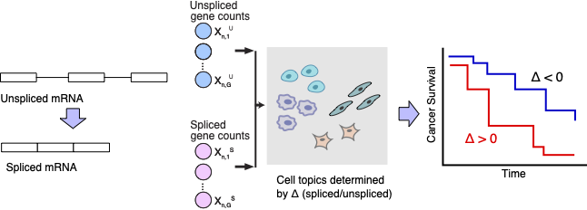

[![PyPi][badge-pypi]][link-pypi]
[![Docs][badge-docs]][link-docs]

[badge-pypi]: https://badge.fury.io/py/DeltaTopic.svg
[link-pypi]: https://pypi.org/project/DeltaTopic/
[badge-docs]: https://readthedocs.org/projects/deltatopic/badge/?version=latest
[link-docs]: https://deltatopic.readthedocs.io

## DeltaTopic: Dynamically-Encoded Latent Transcriptomic pattern Analysis by Topic modelling

<div align="center">
    
</div>

###
This is a project repository for the paper

- Zhang, Y., Khalilitousi, M. and Park, Y.P., [Unraveling dynamically-encoded latent transcriptomic patterns in pancreatic cancer cells by topic modelling](https://www.biorxiv.org/content/10.1101/2023.03.11.532182v1.abstract), Cell Genomics, 2023.

### Summary

Building a comprehensive topic model has become an important research tool in single-cell genomics. With a topic model, we can decompose and ascertain distinctive cell topics shared across multiple cells, and the gene programs implicated by each topic can later serve as a predictive model in translational studies. Here, we present a Bayesian topic model that can uncover short-term RNA velocity patterns from a plethora of spliced and unspliced single-cell RNA-seq counts. We showed that modelling both types of RNA counts can improve robustness in statistical estimation and reveal new aspects of dynamic changes that can be missed in static analysis. We showcase that our modelling framework can be used to identify statistically-significant dynamic gene programs in pancreatic cancer data. Our results discovered that seven dynamic gene programs (topics) are highly correlated with cancer prognosis and generally enrich immune cell types and pathways.

### Installation

DeltaTopic requires Python 3.8 or later. We recommend using [Miniconda](http://conda.pydata.org/miniconda.html).

Install DeltaTopic from [PyPI](https://pypi.org/project/DeltaTopic) using:

```bash
pip install DeltaTopic
```

  
To work with the latest development version, install from [GitHub](https://github.com/causalpathlab/deltaTopic) using:

```bash
python3 -m pip install git+https://github.com/causalpathlab/DeltaTopic
```

#### For full documentaion, please refer to [Documentation](https://deltatopic.readthedocs.io/en/latest/)
